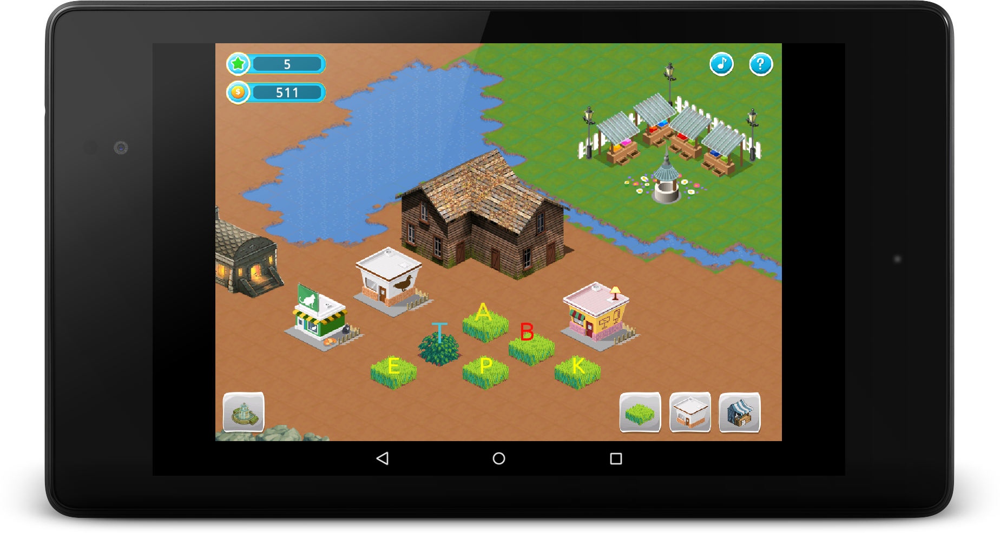

## Welcome to Phoenicia

Phoenicia is an Android game designed to teach literacy and numeracy to children in an unguided way.

**Phoenicia is in very early development*, this screenshot will be updated as it progresses

## Gameplay

In Phoenicia, learning to read, write and do basic math is a consequence of playing the game, rather than the goal of it. For the player, the fun is in building up their virtual world, creating things in it, and selling those items for other items.

Children learn and retain information better when it is necessary part of the goal they are trying to reach. By making the learning aspect a requirement, and slowly adjusting the difficulty of that as the player progresses, the game remains entertaining and motivating while reinvorcing the knowledge that the player gains along the way.

### Letter recognition
Players will start with a small farm or garden (depending on locale) where they will start raising crops of letters. Each letter will produce it's name and sound through various player interactions to build an association between the letter and the sound it represents.

### Literacy

Once a few common consonants and vowels are produced, the player will be taught how to combine them to form short, familiar words. These newly formed words become assets that the player uses to progress through the game. Creating words consumes the letters used to form it, so the player much continuously raise and harvest (or purchase) new ones.

As the player progresses in the game, new letters will become available to them, and thus new words as well. They will be prompted to try and build specific words, and encouraged throughout the game to experiment with letter combinations on their own.

### Numeracy

Progressios through the game is driven by a marketplace where the player can sell their words and letters, earning in-game currency. This currency can then be used to purchase additional letters (raising them takes time, and not all letters can be raised as crops). During these exchanges the player will be encouraged to calculate small sums and differences themselves to speed up gameplay, with a fallback to counting up or down one item at a time.

### Socializing

Even though Phoenicia is designed to be a single-player, offline game, the social aspect of learning has not been forgotten. Players will be encouraged to share the words they learn to spell with their friends, who can then create those words (if they have the letters) even if they haven't themselves progressed to the level where that word will be introduced. These words can then be sold in the marketplace for a higher in-game currency value than the words at the player's own level. This gives the **knowledge** of spelling a social and economic value, which in turn will encourage the children and their peers to obtain more of it.

## Contributing

You should be able to clone Phoenicia's Git repository and open it in Android Studio. It is being developed on Ubuntu 15.04 and Android Studio 
1.1. [Dependencies](##Dependencies) are included in the Git branch.

*Phoenicia is a new project, with very little working at the moment. You are welcome to try the code out, and contribute to it, but expect it to change significantly and rapidly*

### Localization

Phoenicia will be able to include "Locale Packs" which provide unique artwork, sounds, letter and word assets specific to a targeted community. In addition, each locale will have it's own specific progression of letters and words defined for that locale.

*Once this localization support is working, more information will be added here about contributing to a locale pack*

### License

Phoenicia is provided under the GPLv3 open source license. It makes use of some [dependencies](##Dependencies) that are provided under other compatible open source license.

### X-Prize

Phoenicia is being developed as part of the [Global Learning X-Prize](http://learning.xprize.org/) competition. While the code is being developed in the open, under the GPLv3 license, the X-Prize rules require that finalists be released under the APL. Because of this, contributors must sign a CLA which will allow for that re-licensing in the event that Phoenicia is chosen as a finalist.

## Dependencies

In addition to Android, Phoenicia makes use of:

* AndEngine developed by Nicolas Gramlich
    * [GLES2-AnchorCenter](https://github.com/nicolasgramlich/AndEngine/tree/GLES2-AnchorCenter) branch
    * Included from app/src/main/libs/andengine.jar
* AndEngineTMXTiledMapExtension by Nicolas Gramlich 
    * [GLES2-AnchorCenter_isometric](https://github.com/Niffy/AndEngineTMXTiledMapExtension/tree/GLES2-AnchorCenter_isometric) branch by Paul Robinson
    * Inline in app/src/main/java/org/andengine/extension/tmx/